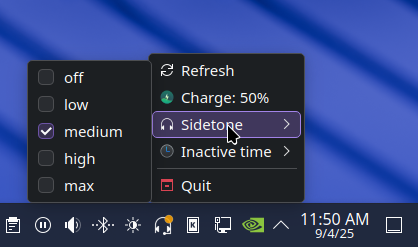

[](https://github.com/jpsutton/headset-charge-indicator-qt/releases)
[](https://github.com/jpsutton/headset-charge-indicator-qt/releases/latest)
[](https://github.com/jpsutton/headset-charge-indicator-qt/tags)

# Headset Charge Indicator (Qt6/KDE Edition)

A Qt6-based system tray application for displaying battery charge and controlling features of
various wireless headsets, with enhanced KDE Plasma integration.

> **Note**: This is a complete Qt6/KDE rewrite of the original [headset-charge-indicator](https://github.com/centic9/headset-charge-indicator) by [centic9](https://github.com/centic9). 
> 
> **For GNOME users**: Please use the [original GTK/AppIndicator version](https://github.com/centic9/headset-charge-indicator) which is specifically designed for GNOME desktop environments.
> 
> **Credit**: Original concept, design, and implementation by [centic9](https://github.com/centic9). This Qt6 port focuses on enhanced KDE Plasma integration while maintaining compatibility with the original HeadsetControl backend.



It supports displaying the battery charge with color-coded icons, desktop notifications, turning on/off LEDs and adjusting the sidetone level of the microphone. 

It additionally supports displaying the 'chat-mix' level of Steelseries Arctis headphones.

It uses the tool from https://github.com/Sapd/HeadsetControl/ for connecting to a number of
popular headsets and fetches information for displaying in the system tray.

The application features:
- Native Qt6 system tray integration
- Enhanced KDE Plasma support with rich tooltips
- Color-coded battery level indicators (red/orange/green)
- Desktop notifications for battery level changes
- Persistent settings storage for headset configurations

## Installation

### Qt6 and System Dependencies

On Ubuntu/Debian based distributions, install the following packages:

    sudo apt-get install python3-pyside6.qtcore python3-pyside6.qtwidgets python3-pyside6.qtgui

On Arch Linux, install the required Qt6 packages:

    sudo pacman -S python-pyside6

On Fedora, install the Qt6 Python bindings:

    sudo dnf install python3-pyside6

For enhanced KDE integration (optional), you may also want to install KDE development libraries, though the application will work with basic Qt6 system tray functionality on any desktop environment.

### Building HeadsetControl

Follow the instructions at https://github.com/Sapd/HeadsetControl/ for building the binary and
note down the path to it.

You can test the helper application manually via `headsetcontrol -b -c`, this should print the current
battery level to the console if your headset is supported.

## Usage

Build/install the required executable `headseatcontrol` according to the instructions 
above, then start the headset-charge-indicator via 

    python3 headset-charge-indicator.py

A Headset-icon should appear in the system tray with battery percentage information.

You can optionally supply a path to the `headsetcontrol` binary.

### Commandline

```
$ ./headset-charge-indicator.py -h
usage: headset-charge-indicator.py [-h] [--headsetcontrol-binary <path to headsetcontrol binary>] [--verbose] [--low-battery <percentage>] [--medium-battery <percentage>] [--no-notifications] [--poll-interval <seconds>] [--icon-name <icon-name>] [--force-qt]

    Qt6 System Tray application which uses the HeadsetControl application from 
    https://github.com/Sapd/HeadsetControl/ for retrieving charge information
    for wireless headsets and displays it as system tray icon with native tooltips.
    
    Enhanced for KDE Plasma Desktop with:
    - Native tooltip support showing battery percentage
    - Color-coded icons (red/orange/normal based on battery level)
    - Desktop notifications for battery level changes and critical levels
    
    The application has optional commandline arguments for customizing behavior,
    battery thresholds, and notification settings.
    

optional arguments:
  -h, --help            show this help message and exit
  --headsetcontrol-binary <path to headsetcontrol binary>
                        Optional path to headsetcontrol binary
  --verbose             Increase output verbosity
  --low-battery <percentage>
                        Battery percentage threshold for red icon (default: 20)
  --medium-battery <percentage>
                        Battery percentage threshold for orange icon (default: 50)
  --no-notifications   Disable desktop notifications
  --poll-interval <seconds>
                        Polling interval in seconds (default: 60)
  --icon-name <icon-name>
                        Specific icon name to use (e.g. "audio-headset-symbolic" for monochrome)
  --force-qt           Force use of Qt system tray instead of KDE libraries
```

## Supported Headsets

Look at the description of https://github.com/Sapd/HeadsetControl/, headset which support 
at least fetching battery information are supported here as well, other functionality will work 
if the headset supports it.

## Supported Desktop Envrionemnts

The tool uses Qt6 system tray functionality with optional KDE integration. It should work 
on most desktop environments that support system tray icons.

Currently known behavior/support:

* **KDE Plasma**: Works fully with enhanced features
   * Rich HTML tooltips showing battery status
   * Native KDE notifications
   * Full system tray integration
* **LXQt**: Works well with Qt-based system tray support
* **XFCE**: Works with standard system tray support
* **Cinnamon**: Works with system tray functionality
* **MATE**: Works with system tray support
* **LXDE**: Works with basic system tray functionality
* **GNOME**: **Use [original version](https://github.com/centic9/headset-charge-indicator) instead**
   * While this Qt6 version may work, GNOME users should use the original GTK/AppIndicator version
   * Better integration with GNOME's design and notification system
* **Other environments**: Should work with standard Qt system tray support

The application automatically detects KDE libraries and uses enhanced features when available,
falling back to standard Qt6 system tray functionality on other desktop environments.

## Development/Debugging

The following information was helpful in developing this tool:
* https://doc.qt.io/qtforpython/PySide6/QtWidgets/QSystemTrayIcon.html
* https://doc.qt.io/qt-6/qsystemtrayicon.html
* https://develop.kde.org/docs/extend/plasma/applets/

The python application will print out some information to standard-output which may give some
more information if things go wrong.

You can test Qt6 functionality with the included `test-qt6.py` script.

## Licensing

* headset-charge-indicator is licensed under the [BSD 2-Clause License].

[BSD 2-Clause License]: https://opensource.org/licenses/bsd-license.php

## Credits

This Qt6/KDE version is based on the original [headset-charge-indicator](https://github.com/centic9/headset-charge-indicator) by [centic9](https://github.com/centic9). 

The original author deserves full credit for the concept, design, and initial implementation. This fork focuses specifically on providing enhanced KDE Plasma integration through Qt6 while maintaining compatibility with the HeadsetControl backend.

## Like it?

If you like this Qt6/KDE version, please star this repository.

If you found the original concept useful, please also star [the original repository](https://github.com/centic9/headset-charge-indicator) by [centic9](https://github.com/centic9).


